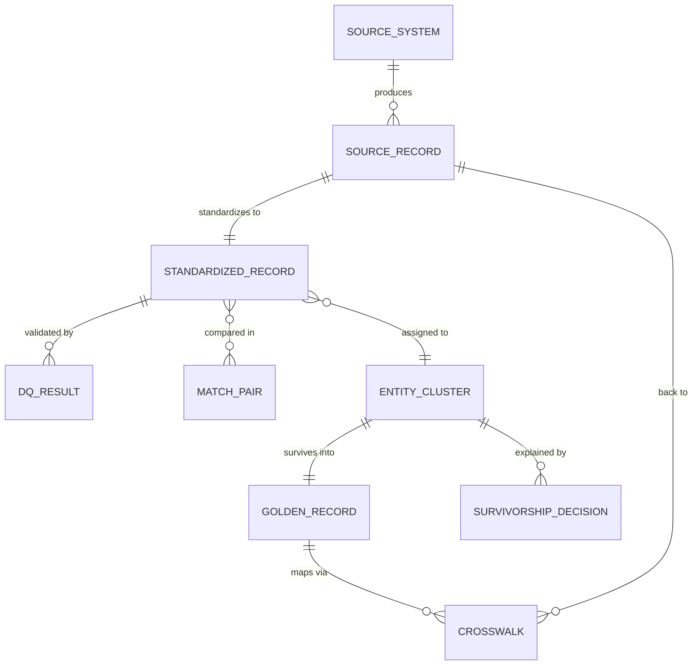

# Logical Data Model

## Entity relationships

## Canonical customer attributes

| Attribute | Type | Notes |
|---|---|---|
| full_name | string | title-cased, honorifics stripped |
| email | string | lowercase; nulled if invalid |
| phone | string | 10-digit national number |
| address_line | string | abbreviations expanded |
| city | string | reference-normalized (e.g. Gurgaon->Gurugram) |
| state | string | 2-letter code via reference lookup |
| country | string | ISO-2 via reference lookup |
| date_of_birth | date | ISO yyyy-MM-dd, multi-format parsed |

## Physical tables

### bronze.customer_raw
| Column | Purpose |
|---|---|
| record_uid | sha2(source_id || source_record_id), the platform-wide stable key |
| source_id, source_record_id | source identity |
| batch_id, ingest_ts | ingestion metadata |
| trust_rank | from source registry, consumed by survivorship |
| raw_payload | full original record as JSON, immutable evidence |
| source_updated_at | source-side change timestamp (watermark + recency survivorship) |
| canonical attributes | renamed via field_map, values untouched |

### silver.customer_standardized
Bronze columns with canonical attributes standardized, plus `transform_log`: array of {attribute, raw_value, standardized_value, transforms_applied}, per-record transformation lineage.

### silver.dq_results
`record_uid, source_id, batch_id, rule_id, severity, description`, one row per failed rule per record. Feeds quarantine views, steward dashboards, reconciliation.

### silver.customer_valid / silver.customer_quarantine
Partition of standardized records by DQ outcome. Valid records carry `dq_status` (VALID / VALID_WITH_WARNINGS) and their WARN annotations.

### gold.match_pairs
`record_uid_1, record_uid_2, score, method (deterministic|probabilistic), decision (MATCH|REVIEW|NO_MATCH|REJECTED_FP_GUARD)`, every compared pair with its outcome. Full matching explainability; REVIEW rows are the steward queue.

### gold.entity_clusters
`record_uid -> cluster_id`. Connected components over MATCH edges.

### gold.survivorship_decisions
`cluster_id, attribute, golden_value, winning_record_uid, winning_source, strategy`, why each golden value is what it is.

### gold.golden_customer
One row per entity: `golden_id` + canonical attributes + `mdm_created_ts, batch_id`.

### gold.crosswalk
`golden_id <-> (record_uid, source_id, source_record_id)`, the MDM crosswalk. Powers lineage tracing, subject-access requests, and source-system enrichment joins.

## Metadata / control tables
The YAML configs (sources, standardization, dq_rules, matching, survivorship) are the control plane; in production they load into Delta control tables at deploy time so every batch records *which rule versions* processed it. The audit log (`stage, source_id, batch_id, metrics, event_ts`) and watermark store complete the operational metadata.
