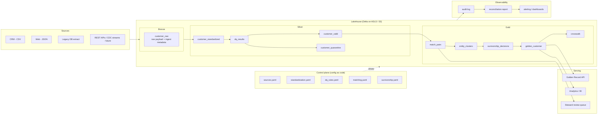

# Enterprise Master Data Platform, Design Document

## 1. Problem framing

Customer data arrives from many independent systems with inconsistent formats, duplicates, gaps and conflicts. Downstream teams cannot trust any single system. The platform's job is to turn that noise into one trusted Golden Record per real-world entity, with full evidence for every value it publishes.

The design goal ordering I used: **trust and traceability first, then extensibility, then throughput.** An MDM platform that cannot explain why a golden value exists will not survive its first data dispute; one that needs a code release for every new source or rule will not survive its first year of operation.

## 2. High-level architecture

## 3. Key architectural decisions and trade-offs

### 3.1 Medallion (Bronze / Silver / Gold) on a lakehouse
**Decision.** Layered Delta Lake tables: Bronze holds the untouched source record plus ingestion metadata; Silver holds standardized, validated data; Gold holds entities, golden records and lineage tables.

**Why.** Immutable Bronze gives replayability (fix a rule, rebuild Silver/Gold without going back to sources) and is the anchor of lineage. Delta gives ACID writes, MERGE for incremental upserts, schema evolution and time travel. Time travel also doubles as free audit history of golden records.

**Trade-off.** Storage is duplicated across layers. That is deliberate: object storage is cheap; re-extracting from upstream systems, and losing evidence, is expensive.

### 3.2 Configuration-driven everything (metadata-driven pipelines)
**Decision.** Sources, standardization transforms, DQ rules, matching strategy and survivorship strategy are all YAML. Code contains only *engines* and a registry of reusable primitives.

**Why.** The assignment's scale assumption is dozens of sources. If each source needs code, the platform team becomes the bottleneck. With this design: new source = one `sources.yaml` entry (format, path, field_map, trust_rank); new DQ rule = one `dq_rules.yaml` entry; changed survivorship policy = YAML edit + reprocess. Configs live in Git, so every rule change is reviewed, versioned and deployable through CI/CD like code, but without touching engine code.

**Trade-off.** A rule engine is more abstract than hard-coded logic and slightly harder to debug. Mitigated by keeping the primitive set small and by logging exactly which rule/transform produced every outcome.

### 3.3 Identity resolution: hybrid deterministic + probabilistic, with blocking
**Decision.** Blocking -> deterministic keys -> weighted fuzzy scoring -> hard false-positive guards -> three-band threshold (auto-match / review / no-match) -> connected-component clustering.

**Why each piece:**
- **Blocking** turns O(n^2) pairwise comparison into roughly O(n * k). Multiple *independent* block keys (name prefix, phone last-4, email prefix) protect recall: a single changed identifier cannot hide a duplicate. (The demo deliberately includes this failure mode and its fix.)
- **Deterministic first** because an exact match on a strong identifier (email; phone+DOB) is cheap, explainable and near-zero false-positive.
- **Probabilistic scoring** (weighted rapidfuzz similarity) catches nicknames, typos, and changed contact details. Weights and methods are config.
- **Threshold bands**: >=0.85 auto-merge, 0.65-0.85 to a human steward review queue, below that no match. In MDM, a false merge (two people become one) is far more damaging than a missed merge because merged records leak data across customers and are painful to unwind. So the auto-match bar is high and ambiguity goes to humans.
- **False-positive guards** hard-reject pairs with conflicting DOB or country regardless of score, cheap insurance against "same-name, same-city" collisions.
- **Threshold selection in practice**: label a sample of scored pairs, plot precision/recall by threshold, pick the auto band for ~99%+ precision and put the recall-heavy region into review. Steward decisions become labelled training data, enabling the ML-assisted matching noted in section 7.

**Trade-off.** A review queue means humans in the loop and non-instant convergence for ambiguous entities. That is the correct trade for a system of record.

### 3.4 Attribute-level survivorship
**Decision.** Golden values are chosen per attribute, not per record, under ordered strategies: e.g. DOB trusts source precedence (stable fact -> system of record), email/phone/address trust recency (contact data decays), with precedence as tiebreak.

**Why.** Record-level survivorship ("CRM wins") throws away the freshest value of every other attribute. The demo shows the payoff: golden Vikram carries CRM's canonical name *and* the web channel's newer phone number. Every winner is recorded with which record and which strategy supplied it (`survivorship_decisions`), attribute-level lineage.

### 3.5 Lineage as data, not documentation
Every stage emits queryable evidence keyed by a stable `record_uid`:
raw payload (Bronze) -> per-attribute transform log (Silver) -> DQ annotations -> match pairs with score/method/decision -> survivorship decisions -> crosswalk. `trace_golden_record(golden_id)` walks the full chain. In production these tables also feed a catalog (Unity Catalog / Purview) for column-level lineage.

## 4. Data quality framework

Severity model: **ERROR quarantines** (record excluded from matching, parked with reasons for stewardship), **WARN annotates** (record proceeds, flagged). Dimensions covered by the shipped rule types: completeness (`not_null`), validity (`regex`, `domain`, datatype via `parse_date` standardization), consistency/business rules (`expression`, arbitrary Spark SQL), uniqueness (`unique`), timeliness (`expression` over source timestamps). Referential integrity is an `expression` join-check against reference tables in the same engine.

Quarantine is not a dead end: records are stored with their failure reasons, dashboards aggregate failures by source and rule, and fixes upstream (or rule corrections) simply reflow on the next batch, Bronze immutability makes reprocessing safe.

## 5. Reconciliation

Automated per-batch, per-source balance check: source -> bronze -> standardized -> (valid + quarantined) -> golden-linked. Any transition that does not balance is an exception in the report with an investigation pointer. Consolidation (valid - golden) is expected shrinkage and is reported as dedup yield, not loss. The audit log carries counts per stage, so drift is detectable batch-over-batch and alertable.

## 6. Non-functional requirements

**Scalability.** Spark scales the standardization, DQ and scoring stages horizontally. The two scale-sensitive designs are matching and clustering: blocking bounds candidate pairs (tunable key granularity), and clustering moves from the demo's driver union-find to GraphFrames connected components at tens of millions of records. Incremental matching compares only new/changed records against existing entity clusters, not the full history.

**Performance.** Delta OPTIMIZE + Z-order/liquid clustering on match keys; broadcast joins for reference data; AQE for skew (common with popular surnames in blocks; mitigated with salting or block-size caps).

**Fault tolerance.** Idempotent stages (deterministic `record_uid`, overwrite-by-batch semantics); job retries; PERMISSIVE readers with corrupt-record capture and dead-letter quarantine rather than pipeline failure; watermarks stored transactionally so replays don't double-ingest.

**Security & privacy.** PII platform: encryption at rest/in transit; column-level masking and RBAC via Unity Catalog; the crosswalk enables GDPR/DPDP subject access and erasure (find every source record for a person in one query); audit of who read golden PII.

**Cost.** Medallion on object storage; job clusters that terminate; incremental processing so cost tracks new data, not total data; quarantine prevents wasted compute on known-bad records downstream.

**Cloud readiness.** The implementation is plain PySpark + Delta and runs unchanged on Databricks (Azure/AWS/GCP) or EMR/Synapse/Dataproc. Orchestration slots into ADF, Airflow or Databricks Workflows, each `run()` stage is already a task boundary.

**Batch and streaming.** Bronze ingestion maps directly to Auto Loader / Structured Streaming with the same field-map config; standardization and DQ are stateless column transforms, so they run identically in `foreachBatch`. Matching runs micro-batch: stream new records, match against the existing entity store, MERGE golden records. CDC sources (Debezium/ADF CDC) land as Bronze appends with operation metadata.

## 7. Observability & operations

- Structured audit events per stage (shipped as JSONL; production: Delta audit table + log pipeline to Grafana/Datadog).
- Metrics: rows in/out per stage, quarantine rate by source and rule, match-band distribution, review-queue depth, reconciliation exceptions, batch latency.
- Alerts: reconciliation exception > 0, quarantine-rate spike vs baseline, review-queue SLA breach, watermark stall (source stopped delivering).
- Dead-letter handling: corrupt rows and ERROR-failing records are parked with reasons, replayable after fix.
- Dashboards: steward view (review queue, quarantine by reason) and operator view (pipeline health, counts, latency).

## 8. Future enhancements

1. **ML-assisted matching**: train a pairwise classifier on steward decisions; the review queue is a labelling machine.
2. **Golden Record API**: REST/GraphQL over `golden_customer` + crosswalk for operational consumers.
3. **Data contracts**: schema + expectations per source enforced at Bronze; contract violation = dead-letter + producer alert.
4. **Catalog integration**: publish lineage tables to Unity Catalog/Purview for column-level lineage UI.
5. **Streaming-first ingestion**: Kafka/Event Hubs + Auto Loader for near-real-time golden record updates.
6. **Multi-entity support**: the engines are entity-agnostic; adding "employer" or "provider" is a config set + canonical schema, not new code.

## 9. Assumptions

- Customer is the first mastered entity; canonical schema kept small for clarity.
- India-centric reference data (phone/state normalization) as a worked example; all of it is config.
- Trust ranks provided by data governance; in reality negotiated with source owners.
- The demo runs Spark local mode with a Parquet/Delta format switch (`TABLE_FORMAT=delta` on any cluster with Delta jars); no logic changes between formats.
